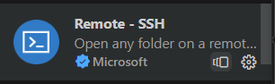
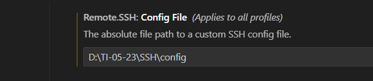

# Preparação de ambiente
### Vamos preparar o ambiente para desenvolvimento de aplicações

#### Nesta preparação iremos instalar e configurar os seguintes recursos:
 - Máquina virtual (VirtualBox)
 - Distribuição Linux (Ubuntu Server)
 - Nasm
 - Compilador da linguagem C
 - Configurar o IP e a porta de comunicação entre a máquina real e virtual
 - Configurar o acesso via SSH entre o VSCode e o servidorLinux
 - Instalar as extensões: Material Icon, Nasm, SSH e linguagem C/C++ 

 #### Máquina virtual (VirtualBox)

 


 Máquina virtual é uma ferramenta que permite a criação de novos computadores e a instalação de sistemas operacionais, para estudo ou trabalho.

 Para nosso estudo iremos usar o Virtualbox da Oracle.
 Para fazer Download no link a seguir:

 <a href="https://www.virtualbox.org/wiki/Downloads" target="_blank"> Virtualbox </a>

 ##### Criando a máquina virtual para o nosso estudo.

 - Configuração:
  > - Nome da máquina: Servidor
  > - Memória: 4 GB (4096)
  > - Processador: 2 
  > - Disco 100GB
  > - IP e porta do host: IP 127.0.0.1 e porta 22.
  > - IP e porta do convidado: 10.0.2.15 e 22.

- Tela inicial de configuração


- Configuração do Hardware


- Tela de configuração do Disco


- Tela final de configuração


- Tela de configuração da rede


- Tela de configuração de portas e IP


#### Distribuição Ubuntu Server

Para o nosso estudo iremos utilizar uma distribuição Linux para servidores chamada Ubuntu. 

Acompanhe o processo de instalação 

Faça o download aqui:

<a href="https://ubuntu.com/download/server"
target="_blank"> Ubuntu Server </a>


- Acompanhe a instalação:

- Tela de início de instalação

- Tela de seleção de idioma

- Tela de seleção de teclado

- Tela de tipo de instalação
 
- Tela de configuração de rede

- Tela de configuração do Proxy

- Tela de pacotes de atualização

- Tela de configuração do disco

- Tela layout do disco

- Tela de configuração de rede

- Tela de configuração do usuário

- Tela de configuração do SSH

- Tela do fim da instalação


#### Atualização do Sistema 

Para a correta utilização do servidor Ubuntu que acabamos de instalar, será necessário realizar a atualização do sistema.

- Execute o comando abaixo:

```
sudo apt update -y && sudo apt upgrade -y
```

- Reinicie o seu servidor usando o comando abaixo:

```
reboot 
```
#### Instalação do Compilador NASM

O compilador do NASM é uma ferramenta que nos permite programar em Assembly. Assim é possivel criar programas que manipulam dados que estão nos registradores do processador.

- Para instalar o NASM no Ubuntu, usamos o comando:

```
sudo apt install nasm -y
```
#### Instalação do compilador da linguagem C

Em Linux o compilador da lingugem C é o GCC. Ele é uma ferramenta importante para o desenvolvimento de programas em C.

Para instalar o comando:
```
sudo apt install gcc -y
```
#### Conexão servidor e VScode via SSH

Precisamos instalar uma extensão no VScode para acessar o nosso servidor de forma remota.



Configuração do acesso remoto.




